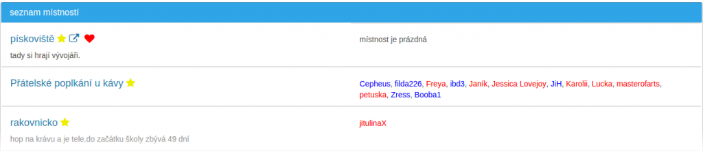

# Chat

Jak napovídá název serveru, je **chat** hlavní službou. Na úvodní stránce je možnost založení nové místnosti a seznam místností.

## Založení místnosti

{: .text-center}

Stačí vyplnit **název** a zmáčnout tlačítko **založit**. Místnost má jednoduchou adresu ve tvaru chat.cz/*název* (např. chat.cz/pokus). Pokud si tuto adresu uložíte do Oblíbených v prohlížeči a necháte stále přihlášení, můžete tak rovnou vstupovat do místnosti. Jen pozor na diakritiku a mezery. Některé starší prohlížeče s nimi nemusí pracovat dobře (např. mezeru zamění za znaménko plus a adresa pak vede jinam).

## Seznam místností

{: .text-center}

[Místnosti](mistnost/index.md) jsou řazeny: nejprve vaše  oblíbené, s lidmi a nakonec prázdné stálé.
V levém sloupci je název a popisek místnosti. Vedle názvu se může objevit několik ikon:

ref ewifonw <i class="fa fa-smile text-danger"></i> df erwpfkewfew0 fef0new

<i class="fa fa-star"></i>&nbsp;– stálá místnost 
<i class="fa fa-lock"></i> – místnost je uzamčená 
<i class="fa fa-people-group"></i> – pouze pro přihlášené uživatele 
<i class="fa fa-car "></i> – jen pro starší 18ti let 
<i class="fa fa-external-link fa- "></i> – odkaz na webovku místnosti 
<i class="fa fa-heart"></i> – místnost je má oblíbená

Vpravo je seznam uživatelů v místnosti. Modře jsou napsáni muži, červeně ženy.
