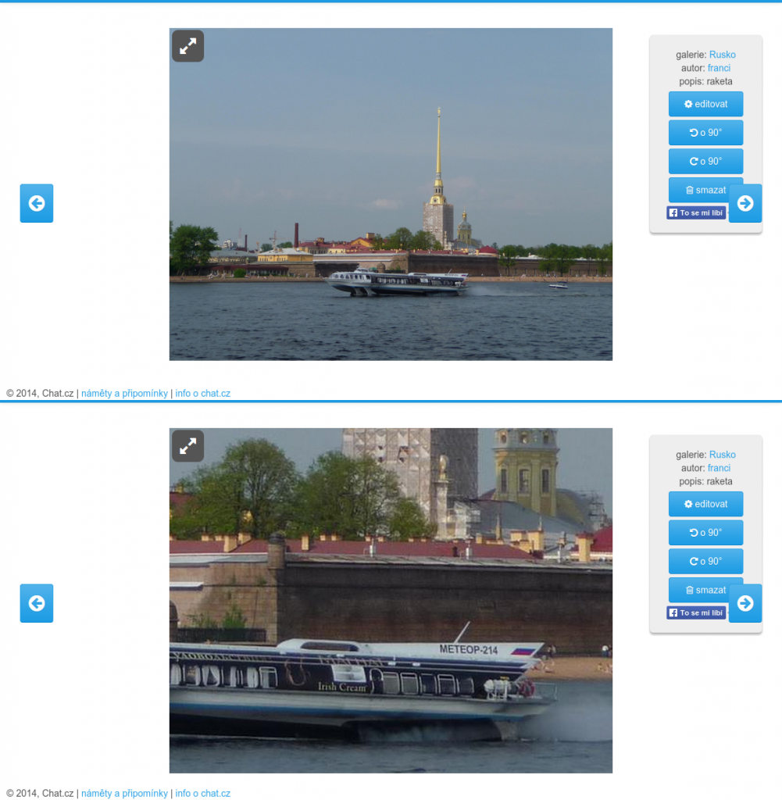

# Fotka

Fotky lze prohlížet buď v základním zobrazení (s menu) nebo v režimu celé stránky (kliknutím na ikonu <i class="fa fa-up-right-and-down-left-from-center"></i> v levém horním rohu fotky).

{: .text-center .col-8 .offset-2}

V základním zobrazení (viz. obrázek), lze fotku zoomovat pomocí kolečka myši a s výřezem posunovat.

Vpravo je menu, kterém jsou odkazy zpět na galerii, všechny fotky autora a popisek fotky. Lze jej zmenšit pomoci <i class="fa fa-times"></i> a pak je jen pod ikonkou <i class="fa fa-info-circle"></i>.

## Nahlásit fotku

<button class="btn btn-primary"><i class="fa fa-bell"></i> nevhodná</button>

Každý uživatel s karmou má možnost nahlásit nevhodnou fotku. Pokud admin hlášení potvrdí, bude fotka smazaná. Zároveň bude jejímu majiteli odebráno 10 bodů karmy za každého uživatele, kteří obrázek nahlásili. Pokud admin hlášení nepotvrdí (obrázek je v pořádku), přijde každý, kdo ho hlásil, o 1 bod karmy.
Příklad: obrázek nahlásilo 6 uživatelů. Pokud s tím admin souhlasí, přijde jeho autor o 60 bodů karmy. Pokud ne, přijde každý z těch šesti o 1 karmu.
Pokud autor obrázek smaže sám než se admin dostane ke kontrole, žádné odebrání karmy se nekoná.
